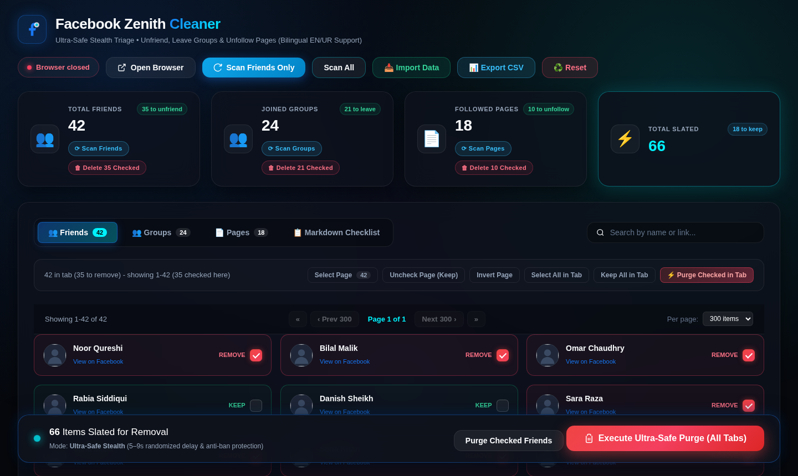
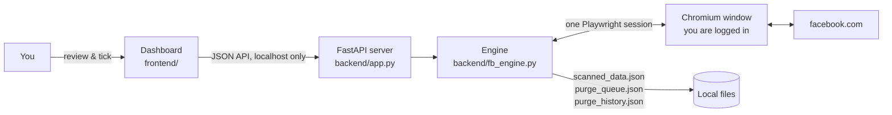

# 🛡️ Facebook Zenith Cleaner

<div align="center">

[](https://github.com/Kamran5H/FacebookCleaner/actions/workflows/ci.yml)
[](LICENSE)
[](https://www.python.org/)
[](https://fastapi.tiangolo.com/)
[](https://playwright.dev/)

**Review your Facebook friends, joined groups and followed pages in one dashboard, then remove the ones you no longer want at a slow, human pace.**

[Quick start](#-quick-start) · [How it works](#-how-it-works) · [Safety](#-safety-features) · [Other ways to scan](#-other-ways-to-collect-your-lists) · [Development](#-development) · [Troubleshooting](#-troubleshooting)


<sub>Screenshot uses made-up demo data.</sub>

</div>

---

## ✨ What it does

| | |
| --- | --- |
| 👥 **Friends** | Scans your full friends list and unfriends the ones you tick. |
| 🏘️ **Groups** | Lists every group you joined and leaves the ones you tick. |
| 📄 **Pages** | Lists liked and followed pages and unfollows the ones you tick. |
| 🔎 **Review** | Live search, 300-per-page paging, bulk select, keep or invert, and a Markdown checklist view. |
| 📤 **Export** | Download everything as CSV or a Markdown checklist before you change anything. |
| ♻️ **Resume** | A purge that stops because of a crash, a power cut or a closed browser can be resumed later. |

Everything runs **on your own computer**. You sign in to Facebook yourself in a normal browser window. The app never sees or stores your password.

---

## ⚡ Quick start

### Windows (recommended)

1. Install **Python 3.10 or newer** from [python.org](https://www.python.org/downloads/) and tick **"Add python.exe to PATH"**.
2. Double-click **`setup.bat`**. It creates a private `.venv`, installs the packages and Chromium, and puts a **Facebook Zenith Cleaner** shortcut on your desktop.
3. Open the desktop shortcut. The dashboard opens at **http://127.0.0.1:8766**.

To see server logs while it runs, use **`run_fb_cleaner.bat`**. It keeps a console window open.

### Manual install (any OS)

```bash
git clone https://github.com/Kamran5H/FacebookCleaner.git
cd FacebookCleaner

python -m venv .venv
# Windows: .venv\Scripts\activate      macOS/Linux: source .venv/bin/activate

pip install -r requirements.txt
python -m playwright install chromium

python backend/app.py --open          # add --port 9000 to change the port
```

Then open **http://127.0.0.1:8766** if it didn't open by itself.

---

## 🧭 How it works

1. **Open Browser**: a real Chromium window opens. Log in to Facebook there, once. The login is kept in a local profile, so you won't need to log in again next time.
2. **Scan**: pick *Scan Friends Only*, a single category, or *Scan All*. The app scrolls your lists and fills the dashboard.
3. **Review**: every scanned item starts out ticked for **REMOVE**. Untick anyone you want to **KEEP**. Your choices are saved and survive re-scans.
4. **Purge**: press *Purge Checked* for one tab or *Execute Ultra-Safe Purge* for all tabs. Then type **REMOVE** to confirm.
5. **Watch or stop**: a live log shows each item. *Stop* ends the run after the current item, and anything left over can be resumed later.



---

## 🛡️ Safety features

- **Slow, human pacing.** Each removal is followed by a random **5–9 second** wait, and every **15 items** there's an **18–28 second** cooling break. The run pauses automatically if Facebook starts throttling.
- **You must type REMOVE.** Removals can't be undone, so pressing OK or Enter by habit isn't enough to start one.
- **The server decides what to remove.** The dashboard sends only ids. The server removes only items that it has stored as ticked, so an old browser tab can't remove the wrong people.
- **Your own account is never touched.** You're recognised by your Facebook account id (the `c_user` cookie), not by your name, so friends who share your name are still handled normally.
- **Restarts are safe.** The purge queue is saved after every item, so a crash or power cut loses nothing.
- **Only this computer can use the app.** The server listens only on `127.0.0.1`. It rejects requests with a foreign `Host` header, which blocks DNS-rebinding attacks. Websites you visit can't start scans or purges. Only the Facebook-tab importer may send data in, and only its lists.
- **Imports can only contain Facebook links.** Lists sent in by the collector or extension are checked, and non-Facebook URLs are dropped. The logged-in browser can't be sent to any other site.

> ⚠️ Automating actions on Facebook may break Facebook's Terms of Service and can get your account rate-limited. Use a conservative pace, run in small batches, and use this at your own risk.

---

## 🧩 Other ways to collect your lists

| Tool | When to use it |
| --- | --- |
| **In-tab collector** (`facebook_300_collector.js`) | When you already have Facebook open in your everyday browser. Open a friends, groups or pages list, press **F12**, open **Console** and paste the file's contents. It scrolls, collects the list, sends it to the running app, and can also save a JSON file for **Import Data**. |
| **Browser extension** (`extension/`) | In Chrome or Edge, open `chrome://extensions`, turn on **Developer mode**, click **Load unpacked** and choose the `extension` folder. Then click its icon on Facebook. |
| **`run_scan_direct.py`** | A standalone command-line scanner. It opens its own window, scans all three lists and saves them to `scanned_data.json`. Your earlier keep and remove choices are kept. |
| **`facebook_in_tab_cleaner.js`** | Paste it into the DevTools console on a Facebook list for a quick in-page triage overlay. |

The in-tab collector and the extension send their results to `http://127.0.0.1:8766/api/import`, so keep the app running while you use them. Chrome may ask for permission to reach local-network devices. Allow it.

---

## 🗂️ Where your data lives

| File | Contents |
| --- | --- |
| `scanned_data.json` | Scanned lists and your keep or remove choices |
| `purge_queue.json` | The current or interrupted removal job |
| `purge_history.json` | Everything that has been removed |
| `fb_cleaner.log` | Diagnostic log |
| `%LOCALAPPDATA%\FBCleaner\Profile` | The browser profile that keeps you logged in |

The files are kept in the app folder by default. Set the `FBC_DATA_DIR` environment variable to store them somewhere else. All of them are in `.gitignore`, so your friends list can't be committed by accident.

---

## 📁 Project structure

```text
FacebookCleaner/
├── backend/
│   ├── app.py                  # FastAPI server, JSON API, local-only guard
│   └── fb_engine.py            # Playwright session, scanners, purge loop
├── frontend/                   # Dashboard (index.html, app.js, style.css)
├── extension/                  # Chrome/Edge MV3 extension (in-tab collector)
├── tests/                      # pytest suite (API guard, import, purge queue)
├── docs/                       # README assets (demo data only)
├── facebook_300_collector.js   # In-tab collector (paste into DevTools console)
├── facebook_in_tab_cleaner.js  # DevTools-console triage overlay
├── run_scan_direct.py          # Standalone visible scanner
├── open_visible_browser.py     # Opens Edge/Chrome on Facebook with its own profile
├── create_icon.py              # Builds fb_cleaner.ico / png
├── create_desktop_shortcut.py  # Desktop shortcut -> launch.vbs
├── launch.vbs                  # Silent launcher (prefers .venv, then newest Python)
├── setup.bat / run_fb_cleaner.bat
├── requirements.txt / requirements-dev.txt
└── LICENSE
```

---

## 🧪 Development

```bash
pip install -r requirements-dev.txt
pytest            # API guard, import sanitising, purge queue, reset
ruff check .      # lint
```

The tests store all their data in a temporary folder through `FBC_DATA_DIR`, so they never touch your real scans. CI runs lint and the tests on Python 3.10 and 3.12, and `node --check` on every JavaScript file.

---

## 🩺 Troubleshooting

| Problem | Fix |
| --- | --- |
| Nothing happens when I open the shortcut | Run `run_fb_cleaner.bat` to see the error. The most common cause is that Python isn't installed or `setup.bat` wasn't run. |
| "Already running" | The app is open already. The launcher just brings the existing window to the front. |
| The browser won't open or keeps crashing | Close every Chromium window the app opened and try again. A stale profile lock is cleared automatically. |
| Many "Content unavailable" failures | Facebook is throttling you. The purge pauses by itself. Wait a while, then use **Resume**. |
| The collector or extension doesn't update the dashboard | Make sure the app is running on port 8766, and allow Chrome's local-network permission prompt. |

---

## 📜 License

Released under the [MIT License](LICENSE). Copyright (c) 2024-2026 **Kamran Ashraf**.
