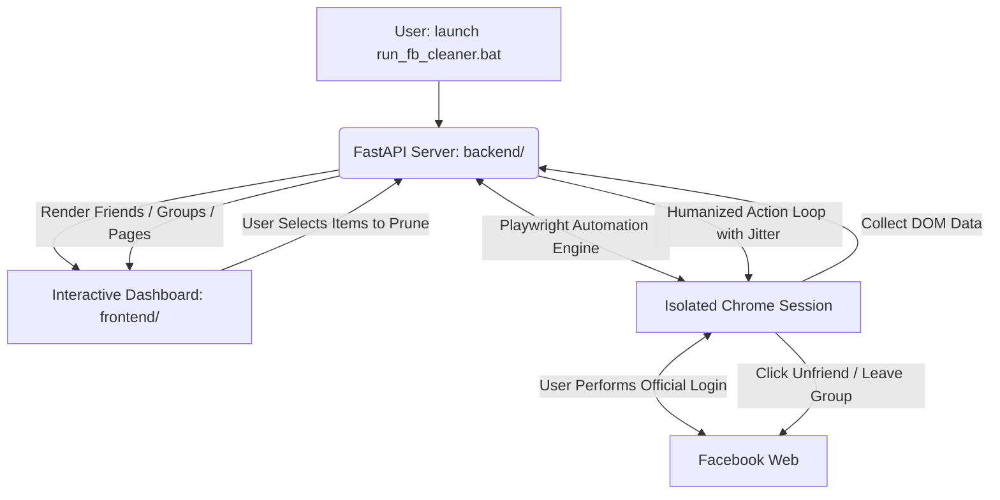

# 🛡️ Facebook Zenith Cleaner

<div align="center">

[](LICENSE)
[](https://fastapi.tiangolo.com/)
[](https://playwright.dev/)
[](https://github.com/Kamran5H/FacebookCleaner)
[](https://github.com/Kamran5H/FacebookCleaner)

**Enterprise desktop triage suite for bulk-scanning, auditing, and safely pruning Facebook friends, joined groups, and followed pages with humanized pacing.**

[Features](#-key-features) • [Architecture](#-architecture) • [Safety & Anti-Ban](#-safety--anti-ban-pacing) • [Quickstart](#-quick-start) • [License](#-license)

</div>

---

## 🌟 Executive Overview

**Facebook Zenith Cleaner** is a privacy-first, desktop application engineered with **FastAPI** and **Playwright**. It provides account owners complete autonomy to audit and declutter their Facebook digital footprint. 

Unlike untrusted third-party browser extensions that compromise passwords, Facebook Zenith Cleaner runs entirely on your local machine. It scans your friends, joined groups, and followed pages into an interactive, visual web dashboard where you review every item, uncheck people or communities you want to keep, and bulk-prune the rest at safe, humanized rates.

---

## 🚀 Key Features

- **👥 Triple-Vector Triage**:
  - **Friends**: Scans friend lists, highlights inactive accounts, and handles bulk unfriending.
  - **Groups**: Identifies dead, archived, or spam groups and executes automated group leaves.
  - **Pages**: Scans all liked/followed brand pages and unfollows with one click.
- **🛡️ Humanized Anti-Ban Cooling**: Implements randomized jitter intervals (3s to 8s between actions) with mandatory cooling pauses after every batch of 20 actions to prevent Facebook automated action blocks.
- **🎨 Interactive Web Dashboard**: Filter items with live instant search, select/deselect all, and view real-time operation progress bars.
- **🔒 Zero Credential Storage**: You log into Facebook once through an isolated, visible Playwright browser instance. Your password is never read, recorded, or transmitted.
- **⚡ One-Click Windows Launch**: Ships with `setup.bat` and `run_fb_cleaner.bat` for instant execution without manual terminal commands.

---

## 🏗️ Architecture



---

## 📁 Repository Structure

```text
FacebookCleaner/
├── backend/                    # FastAPI application, routers & business logic
├── frontend/                   # Interactive triage dashboard (HTML/CSS/JS)
├── setup.bat                   # Turnkey environment installer
├── run_fb_cleaner.bat          # Desktop application launcher
├── launch.vbs                  # Silent background launcher
├── fb_cleaner.ico              # High-resolution application icon
├── requirements.txt            # Python dependencies (fastapi, uvicorn, playwright)
├── .gitignore                  # Virtualenv and runtime cache exclusions
└── LICENSE                     # Open-source MIT License
```

---

## ⚡ Quick Start

### 1. Installation
Simply double-click [`setup.bat`](setup.bat) on Windows, or run manually:
```bash
git clone https://github.com/Kamran5H/FacebookCleaner.git
cd FacebookCleaner

python -m venv .venv
.venv\Scripts\activate

pip install -r requirements.txt
playwright install chromium
```

### 2. Launch Cleaner
Double-click [`run_fb_cleaner.bat`](run_fb_cleaner.bat) or run:
```bash
python run_scan_direct.py
```
Open [http://localhost:8000](http://localhost:8000) to begin auditing your account.

---

## 📜 License

This project is open-source and released under the [MIT License](LICENSE).  
Copyright (c) 2024-2026 **Kamran Ashraf**.
